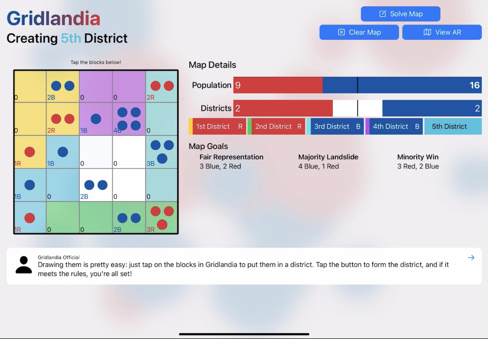
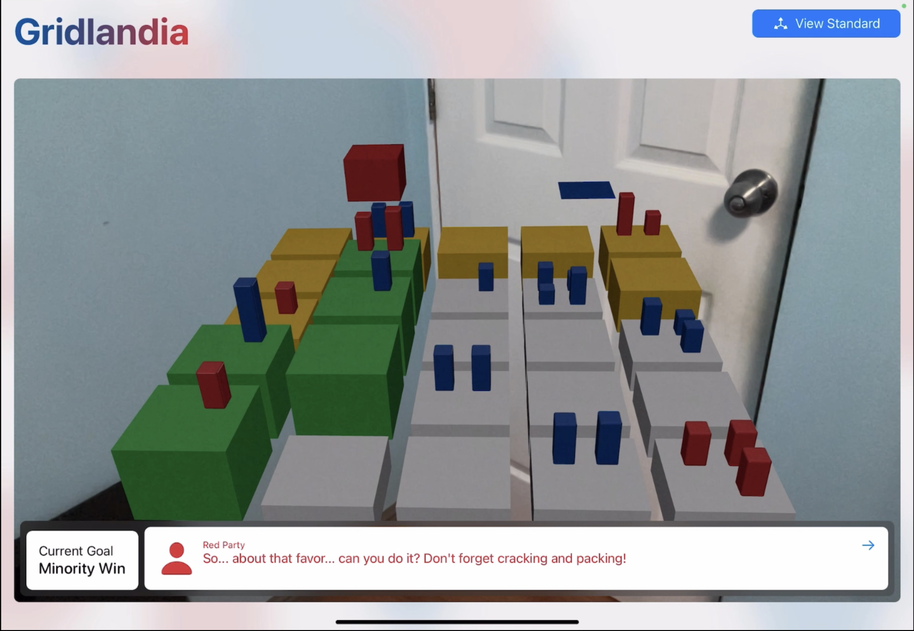
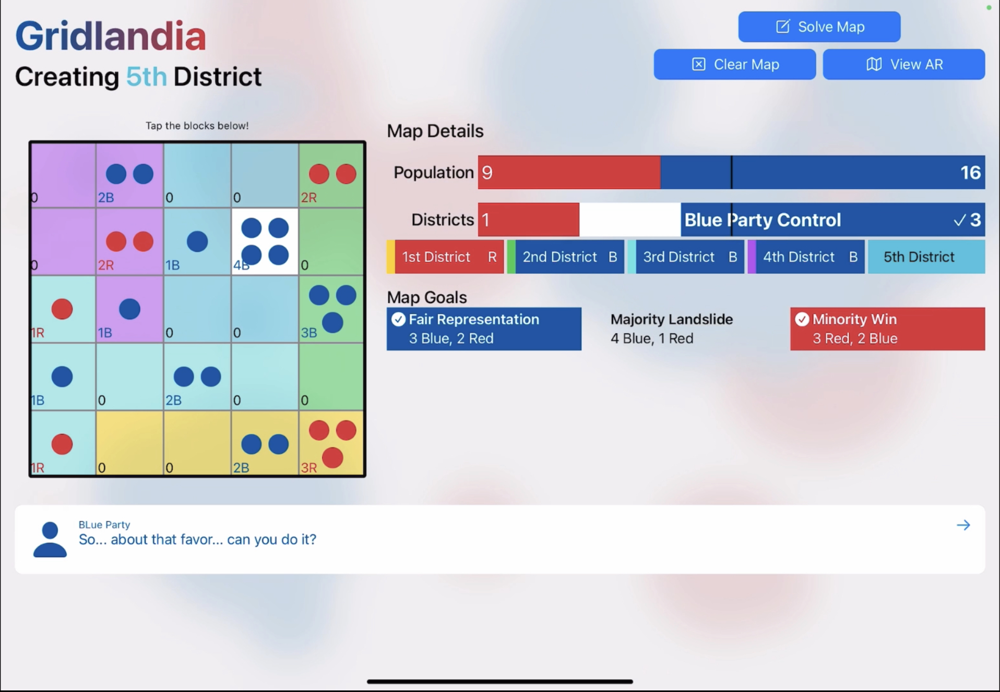

# GerryLearner
Learn the ins and outs of Gerrymandering. Winning entry in the 2022 WWDC Swift Student Challenge.  

## What's Gerrymandering?
Gerrymandering is the deliberate drawing of legislative districts that would favor one side over the other. You may have heard that in the news, [especially if](https://www.nbcnews.com/politics/congress/court-rules-ny-democrats-gerrymandered-congressional-map-rcna25549) [you're an American](https://www.latimes.com/politics/newsletter/2022-04-22/republicans-still-gerrymandering-not-helping-them-as-much-essential-politics).

## What's GerryLearner?
GerryLearner is an app that's designed to teach the user what gerrymandering is. It walks the user through how districting works -- how they'll group up the population of Blue Party supporters and Red Party supporters into 5 fair districts in the city's council. The user will then hear out from the Blue Party and Red Party on how to draw the districts in a way that'll unfairly benefit them over the other.

Once the user is done with that (and hopefully learn something in the process), they could try it out on 3 more cities, or let GerryLearner generate an entirely random one to district (fairly or unfairly).

Stumped? The user could choose to show the solutions for the different gerrymandering scenarios for the starting city and the 3 other pre-loaded cities.

If the user wants to feel fancy, they could project the city they're districting into an AR view. If you load the app, try it -- it'll make you feel like you're those big news studios on election night with their fancy graphics.

## What does GerryLearner look like?
[Here's a video walkthrough!](https://youtu.be/FFj4SimWzpM) 

And here are some screenshots:

  
  
  
  

## What's behind GerryLearner?
GerryLearner is built from the ground-up entirely with Swift and SwiftUI. The AR view is powered by (you guessed it) ARKit, with RealityKit being used to generate the entities being projected and interacted with. GameplayKit is used for specialized random generation, so that the app could randomly generate cities that are possible to district.

## Can I use your code?
Sure! Took me a while to actually work out properly functioning AR code, so hopefully this makes your job easier!

## I have more questions!
I'm on [Twitter](https://twitter.com/_Francodes), so feel free to shoot me a message there!